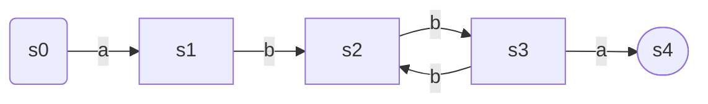
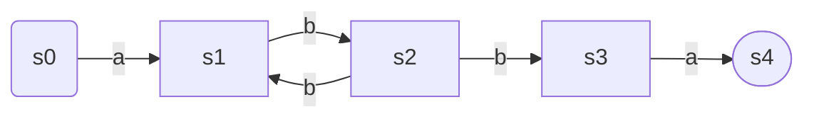
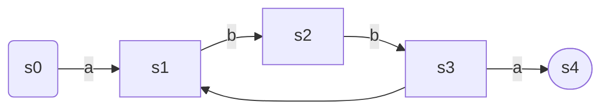
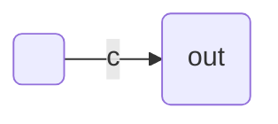
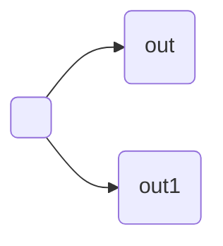
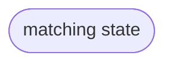

# regular expression and automata

Materials:
-[regular expression matching can be simple and fast](https://swtch.com/~rsc/regexp/regexp1.html-expressions)

Why doesn't Perl use the Thompson NFA?
Contents:
1. Regular expression
2. Finite automata
3. Regular expression search algorithm

## Regular expression

Special metacharacters: `*+?()|`, escaping with a backslash: `\` to match a metacharacter.
1. If $e^1$ matches $s$ and $e^1$ matches $t$, then $e^1 | e^2$ matches $s$ or $t$. and $e^1e^2$ matches $st$.
2. the metachar, $e^1*$ matches a sequence of $e^1$ zero or more times. $+$ matches one or more times. $?$ matches zero or one.
3. The operator precedence: weakest to strongest. alteration, concatenation, repetition, but parentheses first. $ab | cd$ is equal to $(ab) | (cd)$. $ab*$ is equal to $a(b*)$

Regular Language: is a set of strings that can be matched in a single pass throught the text using only a fixef amount of memo.

Backreference extension(not a regular language): A backreference $\backslash1$ or $\backslash2$ matches the string matched by a previous parethesized experession. $(cat|dog)\backslash1$ matches $catcat$ ,$dogdog$


## Finite automata(State machine)

e.g. 
$a(bb)+a$

The automata reads a char one at a time, and changes state according to the transition rules. If the automata ends in a non-matching state, does not match the string, else match. If during execution, there is no arrow for it to follow corresponding to the current input char, just panic(it does match the string).

This kind of automata is called ***deterministic automata(DFA)***, in any state, each possible input char leads to at most one state.

## Non-deterministic automata(NFA)

e.g.
$a(bb)+a$

An NFA matches an input string if there is some way it can read the string and follow arrows to a matching state.

e.g.
$a(bb)+a$


NFAs can also have arrows with no corresponding input char, which means it can choose to follow an unlabeled arrow without reading any input at any time.

Regular experessions and NFAs are equivalent, every regular experssion has an equivalent NFA and vice versa. DFAs are also equivalent in prower to NFAs and RE.

The number of states in final NFA is at most equal to the length of the original regular expression. This NFA has unlabeled arrows, but it is always possible to remove this unlabeled arrows.

## Implementation

Task:
1. understand how to convert RE to postfix expression
2. understand how to convert postfix expression to NFA
3. understand how to match a string with NFA
4. understand how to convert NFA to DFA

```c
struct State {
    int c;
    State *out;
    State *out1;
    int lastlist;
}; 
```
When $c<256$

when $c=256$

when $c=257$


### Convert RE to postfix expression

Special metacharacters: `*+?()|`.

Think:
1. `|` is weakest, then concatenation `.`, then repetition `*`, `+`, `?`.

e.g.

$a(bb)+a$ == $a.(b.b)+.a$ == $a b b . + . a .$
$a(bb)|ab+a$ == $a.(b.b)|a.b+.a$

1. push a into sa, sa: a, sb:
2. push ( into 


