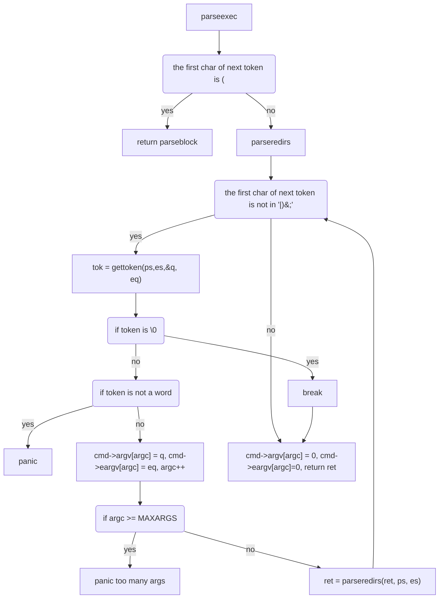
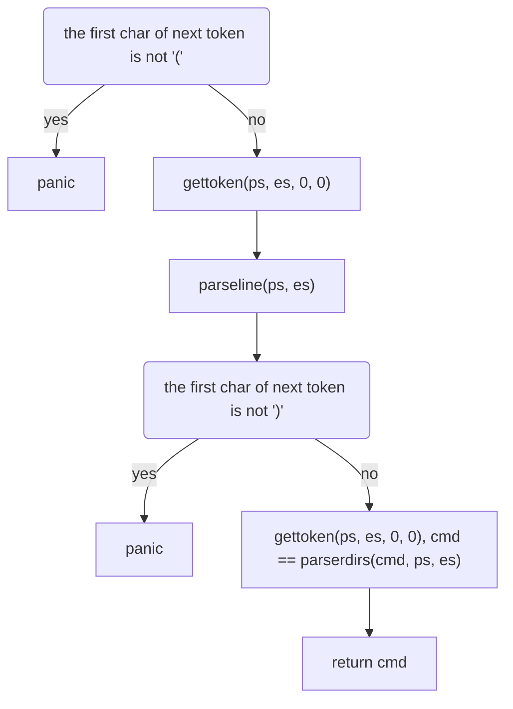
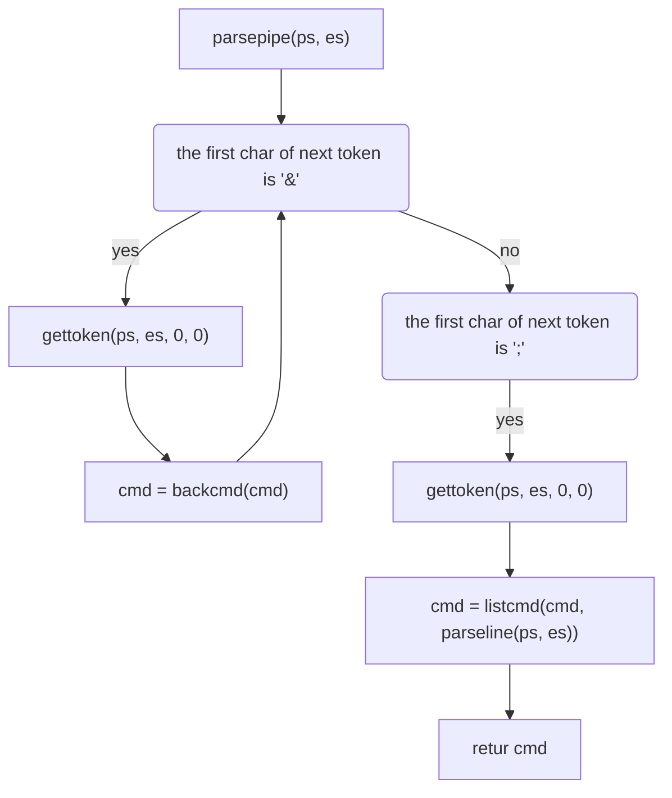
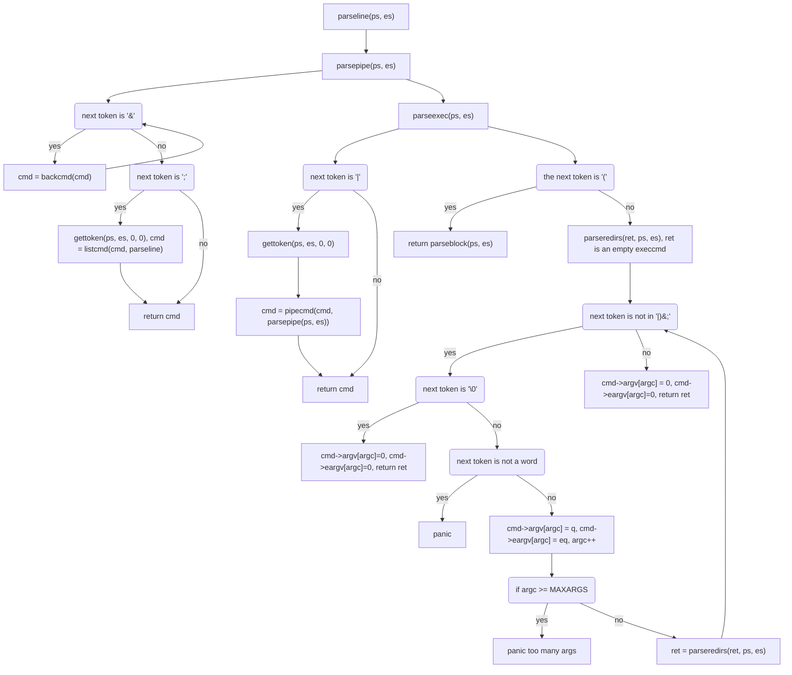

# sh.h

## parseexec

What is the priority of `|)&;` ?

`()` alway has the highest priority. When parse, first deal with `()`

## parseblock

## parseline

The entrance is pareline. It would call `parsepipe()` first, this would generate a `struct pipcmd` then call peek to see wether the next token is `&`. If the next token is `&` it would call `backcmd()` to wrap the original cmd to `backcmd`.

The structure of a command is:
`pipecmd &`

The `parsepipe()` would calls `parseexec()` first to generate an `execcmd`. Then if the next token is `|` if would call pipecmd again.

The structure of a pipe command is:
`pipecmd : execcmd | pipecmd`

The `parseexec()` would call `peek()` to see if the next token is `(` if yes, it would treat `(...)` as an `execcmd` and just call `parseblock(ps, es)` to parse it, then return. If not, it would treate ret as an `redircmd`. Then if next token is `\0` just break, if not a `word`, `panic`. If is a `word` just let `argv` and `eargv` point to `q` and `eq`

The structure of a exec command is:
`execcmd: (...)` or `execcmd: redircmd args...`

The `parseredirs()`, while next token is in `<>`, it would call `gettoken(ps, es, 0, 0)` to store that token into `tok`. after that, if next token is not a `word` do `panic()`. else `switch(tok)` if `<, >, >>` call `redircmd()` to construct a `redircmd`.  

The structure of a redirect command is:
`redircmd: < word` or `> word` or `>> word`

# Summary

`cmd`: `backcmd`, `listcmd`, `pipecmd`, `execcmd`, `redircmd`

`cmd`: `pipecmd [&]* [; cmd]?`, This the `cmd` structure.

listcmd: `pipecmd [&]* (; cmd)+`

backcmd: `cmd [&]*`

block: `(cmd) redirs*`

pipecmd: `(execcmd or block) | pipecmd`

execcmd: `args`

redircmd: `redirs* (execcmd redirs*)*`

redircmd: `(cmd) redirs*`

